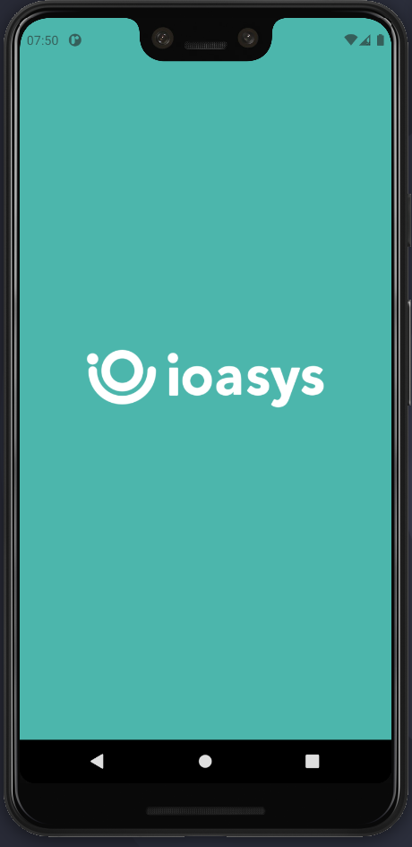
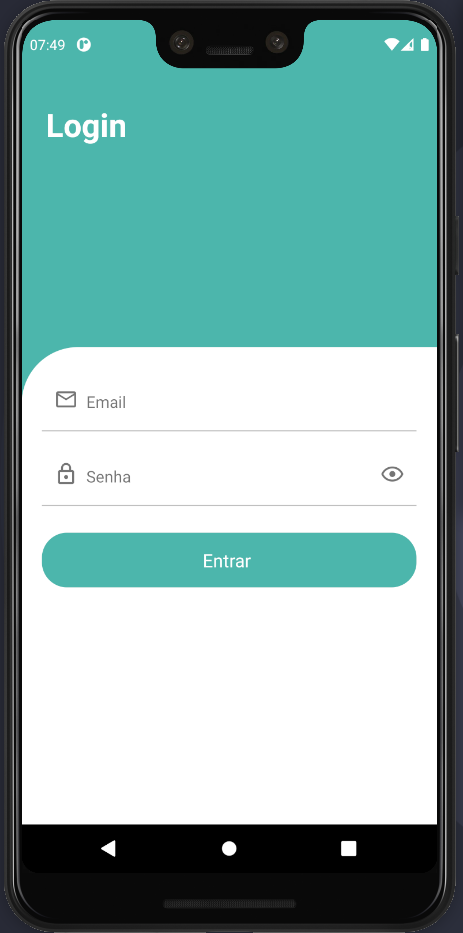
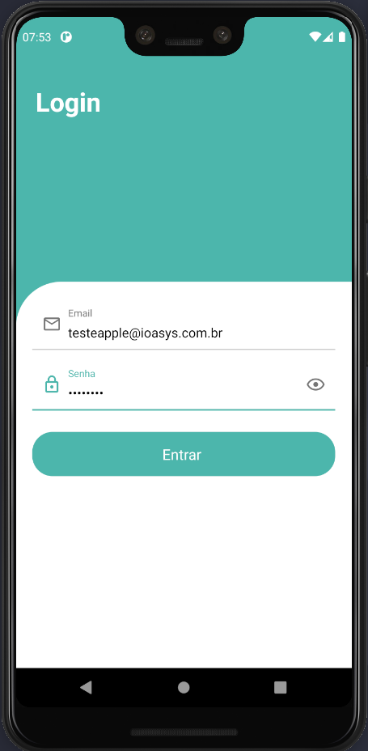
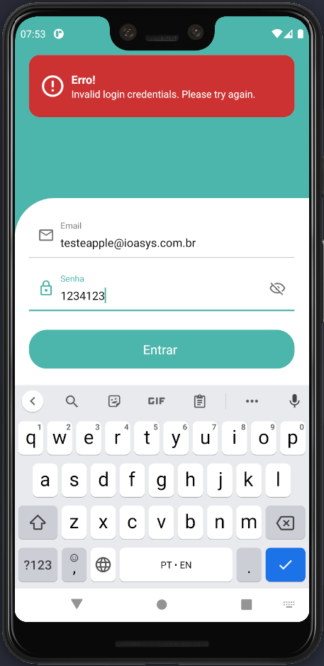
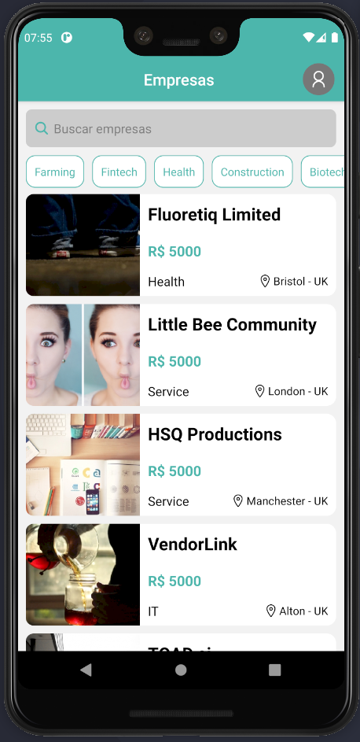
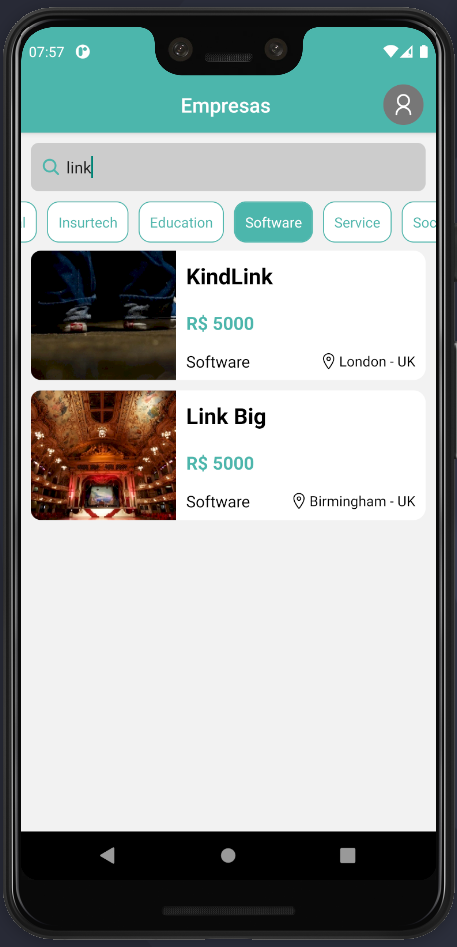
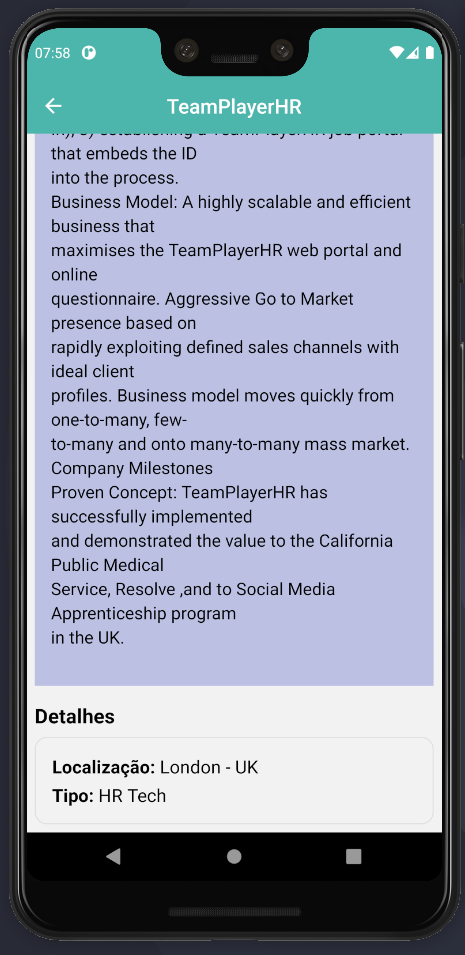
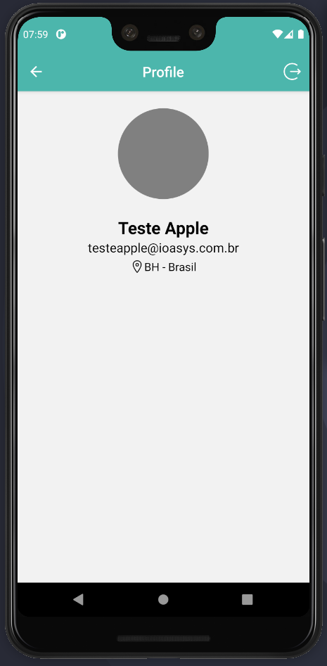

# Desafio React Native - ioasys

 
 
 
 
 
 
 
 
 

## Instalação
Para testar a vesão .apk do aplicativo clique [aqui](IoasysEmpresa.apk) para baixar.

## Building e instruções de uso

Instalaçâo das dependências
```
$ yarn
```

Para testar o aplicativo usando o expo:
```
$ yarn start 
```

Se quiser testar em apenas uma plataforma:
```
$yarn start android
```
ou
```
$yarn start ios
```

### Bibliotecas usadas ###

- `@react-native-async-storage/async-storage`: Usado para leitura e gravação de dados do aplicativo.
- `@react-native-community/masked-view`: Biblioteca necessária para utilização do `react-navigation`.
- `@react-navigation/native`: Biblioteca necessária para utilização do `react-navigation`.
- `axios`: Utilizado para realização de requisições HTTP do aplicativo.
- `expo`: plataforma utilizada para o build do aplicativo em react native.
- `expo-status-bar`: Componente utilizado para controlar a barra de status do aplicativo.
- `react`: Biblioteca necessária para fazer o build em aplicações react native.
- `react-native`: Biblioteca necessária para fazer o build em aplicações react native.
- `react-native-dropdownalert`: Utilizado para fazer o mostrar alertas rápidos (como erro em requisições HTTP) no aplicativo.
- `react-native-gesture-handler`: Biblioteca necessária para utilização do `react-navigation`.
- `react-native-paper`: Necessário para utilização de componentes baseados no Material Design da Google
- `react-native-safe-area-context`: Biblioteca necessária para utilização do `react-navigation`.
- `react-native-screens`: Biblioteca necessária para utilização do `react-navigation`.

### Dados para Teste ###
* Usuário de Teste: testeapple@ioasys.com.br
* Senha de Teste : 12341234